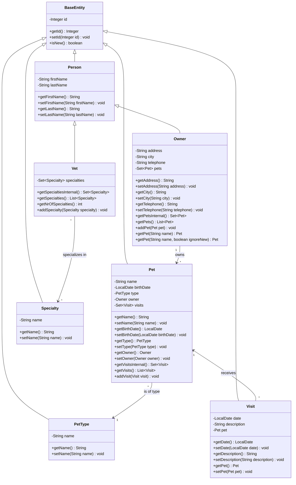
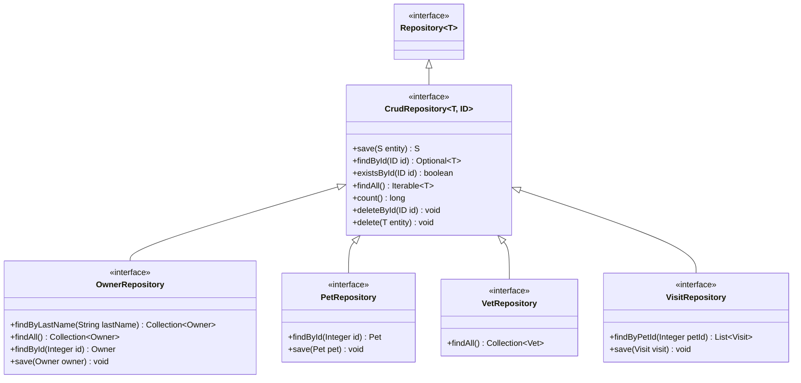
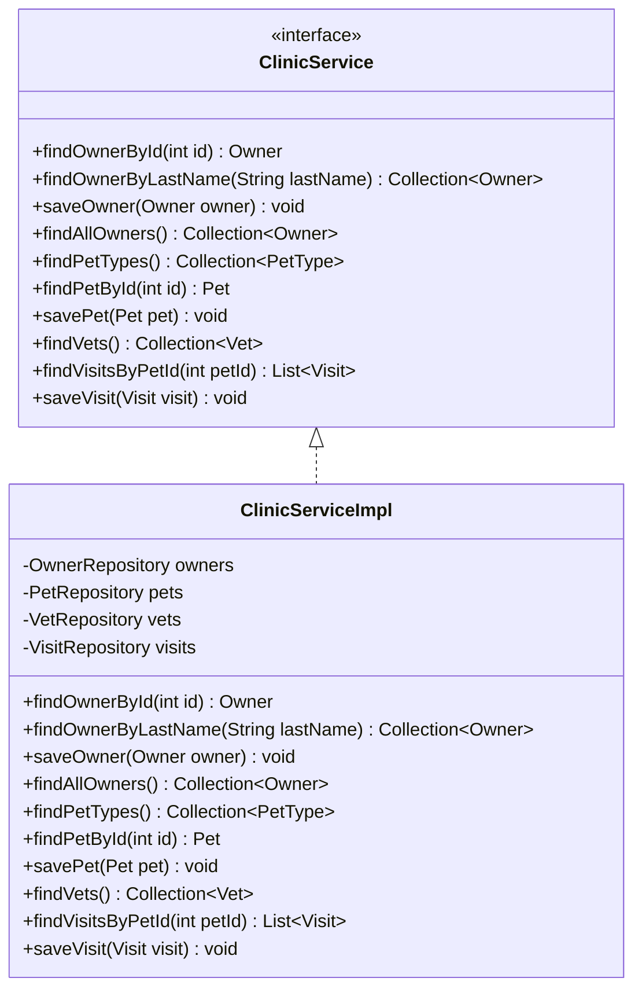
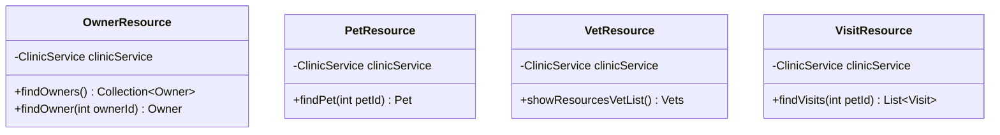
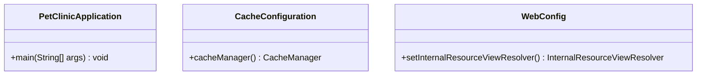

# Class Diagrams

This document provides UML class diagrams for the Spring PetClinic application, organized by architectural layers.

## Core Domain Model

## Repository Layer

## Service Layer

## Controller Layer

```mermaid
classDiagram
    class OwnerController {
        -ClinicService clinicService
        +initCreationForm(Map model) Owner
        +processCreationForm(Owner owner, BindingResult result) String
        +initFindForm(Map model) Owner
        +processFindForm(Owner owner, BindingResult result, Map model) String
        +initUpdateOwnerForm(int ownerId, Model model) String
        +processUpdateOwnerForm(Owner owner, BindingResult result, int ownerId) String
        +showOwner(int ownerId, Model model) String
    }
    
    class PetController {
        -ClinicService clinicService
        +initCreationForm(Owner owner, Model model) Pet
        +processCreationForm(Owner owner, Pet pet, BindingResult result, Model model) String
        +initUpdateForm(int petId, Model model) String
        +processUpdateForm(Pet pet, BindingResult result, int petId, Model model) String
    }
    
    class VisitController {
        -ClinicService clinicService
        +initNewVisitForm(int petId, Map model) Visit
        +processNewVisitForm(Visit visit, BindingResult result) String
    }
    
    class VetController {
        -ClinicService clinicService
        +showVetList(Map model) String
        +showResourcesVetList() Vets
    }
    
    class CrashController {
        +triggerException() String
    }
    
    class WelcomeController {
        +welcome() String
    }
```

## REST API Controllers

## Configuration Classes

