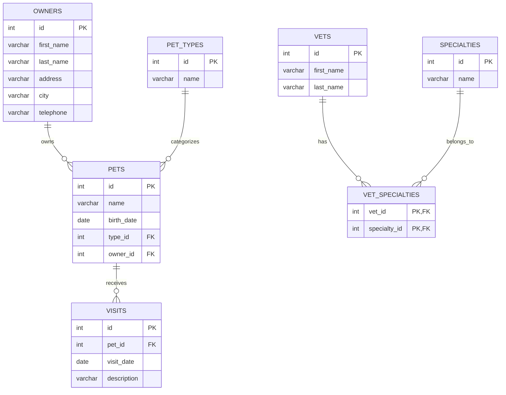

# Database Documentation

Spring PetClinic supports multiple database backends, making it a flexible solution for various deployment scenarios.

## Supported Databases

The application can be configured to work with the following databases:

1. **H2** - In-memory database (default configuration for development)
2. **MySQL** - Production-ready relational database 
3. **PostgreSQL** - Alternative production-ready database

Database selection is managed through Spring profiles in the application properties.

## Database Schema (ERD)

Below is the Entity Relationship Diagram representing the MySQL production schema:

## Table Descriptions

### owners

Stores information about pet owners.

| Column | Type | Description | Constraints |
|--------|------|-------------|------------|
| id | int | Primary key | PK, Auto-increment |
| first_name | varchar(30) | Owner's first name | Not null |
| last_name | varchar(30) | Owner's last name | Not null |
| address | varchar(255) | Street address | Not null |
| city | varchar(80) | City name | Not null |
| telephone | varchar(20) | Contact number | Not null |

**Indexes:**
- Primary key on `id`
- Index on `last_name` for search operations

### pets

Stores information about pets registered in the clinic.

| Column | Type | Description | Constraints |
|--------|------|-------------|------------|
| id | int | Primary key | PK, Auto-increment |
| name | varchar(30) | Pet's name | Not null |
| birth_date | date | Pet's birth date | Not null |
| type_id | int | Reference to pet type | FK to pet_types(id) |
| owner_id | int | Reference to owner | FK to owners(id) |

**Indexes:**
- Primary key on `id`
- Foreign key indexes on `type_id` and `owner_id`

### pet_types

Lookup table for pet species/types.

| Column | Type | Description | Constraints |
|--------|------|-------------|------------|
| id | int | Primary key | PK, Auto-increment |
| name | varchar(80) | Type name (e.g., cat, dog) | Not null |

**Indexes:**
- Primary key on `id`

### vets

Stores information about veterinarians.

| Column | Type | Description | Constraints |
|--------|------|-------------|------------|
| id | int | Primary key | PK, Auto-increment |
| first_name | varchar(30) | Vet's first name | Not null |
| last_name | varchar(30) | Vet's last name | Not null |

**Indexes:**
- Primary key on `id`

### specialties

Lookup table for veterinary specialties.

| Column | Type | Description | Constraints |
|--------|------|-------------|------------|
| id | int | Primary key | PK, Auto-increment |
| name | varchar(80) | Specialty name | Not null |

**Indexes:**
- Primary key on `id`

### vet_specialties

Junction table linking vets to their specialties (many-to-many).

| Column | Type | Description | Constraints |
|--------|------|-------------|------------|
| vet_id | int | Reference to vet | PK, FK to vets(id) |
| specialty_id | int | Reference to specialty | PK, FK to specialties(id) |

**Indexes:**
- Primary key on `(vet_id, specialty_id)`
- Foreign key indexes on both columns

### visits

Stores information about pet visits to the clinic.

| Column | Type | Description | Constraints |
|--------|------|-------------|------------|
| id | int | Primary key | PK, Auto-increment |
| pet_id | int | Reference to pet | FK to pets(id) |
| visit_date | date | Date of the visit | Not null |
| description | varchar(255) | Visit description | Not null |

**Indexes:**
- Primary key on `id`
- Foreign key index on `pet_id`

## Database Configuration

The application uses Spring's profile-based configuration to select the appropriate database:

- **Default (H2)**: Active when no profile is specified
- **MySQL**: Activated with `mysql` profile
- **PostgreSQL**: Activated with `postgres` profile

Connection properties are defined in `application-{profile}.properties` files.
