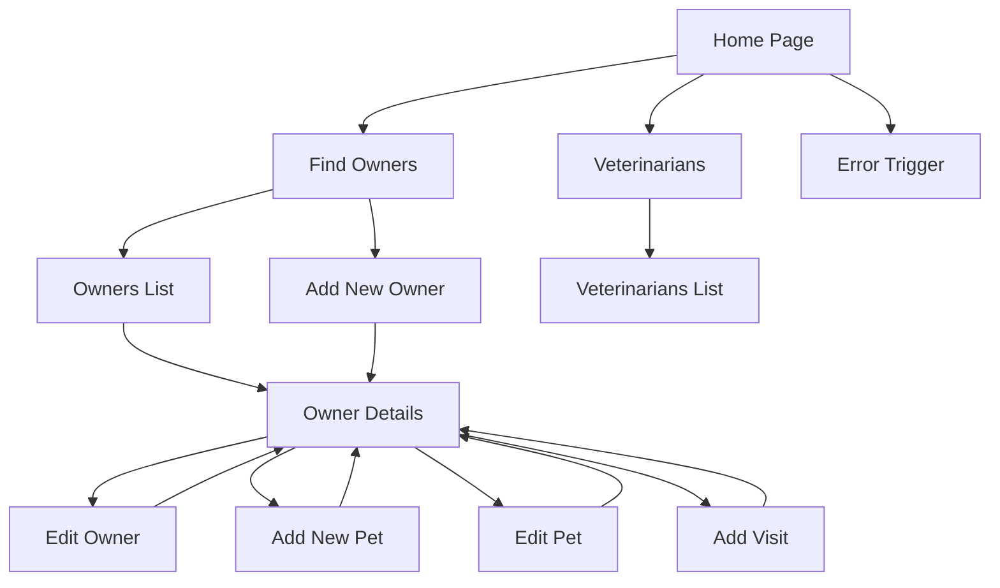

# Web Interface Documentation

This document outlines the user interface flow and REST API endpoints available in the Spring PetClinic application.

## Web UI Navigation Flow

The Spring PetClinic features a multi-page web application with intuitive navigation between related resources.



## Page Descriptions

### Home Page
- **URL**: `/`
- **Description**: Welcome page with navigation links to main sections
- **Controller**: `WelcomeController`

### Find Owners
- **URL**: `/owners/find`
- **Description**: Search form to find owners by last name
- **Controller**: `OwnerController`
- **Features**:
  - Search by last name (partial matches supported)
  - Link to add a new owner

### Owners List
- **URL**: `/owners`
- **Description**: Displays all owners matching the search criteria
- **Controller**: `OwnerController`

### Owner Details
- **URL**: `/owners/{ownerId}`
- **Description**: Displays detailed information about an owner and their pets
- **Controller**: `OwnerController`
- **Features**:
  - Owner contact information
  - List of pets with type and visit history
  - Links to edit owner, add/edit pets, and add visits

### Add/Edit Owner
- **URLs**: `/owners/new` (add), `/owners/{ownerId}/edit` (edit)
- **Description**: Form to create or update owner information
- **Controller**: `OwnerController`
- **Form Fields**: First name, last name, address, city, telephone

### Add/Edit Pet
- **URLs**: `/owners/{ownerId}/pets/new` (add), `/owners/{ownerId}/pets/{petId}/edit` (edit)
- **Description**: Form to create or update pet information
- **Controller**: `PetController`
- **Form Fields**: Name, birth date, type

### Add Visit
- **URL**: `/owners/{ownerId}/pets/{petId}/visits/new`
- **Description**: Form to add a new visit for a pet
- **Controller**: `VisitController`
- **Form Fields**: Date, description

### Veterinarians List
- **URL**: `/vets.html`
- **Description**: Displays a list of veterinarians and their specialties
- **Controller**: `VetController`

### Error Trigger
- **URL**: `/oups`
- **Description**: Deliberately triggers an exception (used for testing error handling)
- **Controller**: `CrashController`

## REST API Endpoints

The application provides a RESTful API that returns data in JSON format.

### Owners API

#### Get All Owners
- **Endpoint**: `GET /api/owners`
- **Controller**: `OwnerResource`
- **Response**: Array of owner objects
- **Example**:
```json
[
  {
    "id": 1,
    "firstName": "George",
    "lastName": "Franklin",
    "address": "110 W. Liberty St.",
    "city": "Madison",
    "telephone": "6085551023",
    "pets": [...]
  },
  ...
]
```

#### Get Owner by ID
- **Endpoint**: `GET /api/owners/{ownerId}`
- **Controller**: `OwnerResource`
- **Response**: Owner object with pets
- **Example**:
```json
{
  "id": 1,
  "firstName": "George",
  "lastName": "Franklin",
  "address": "110 W. Liberty St.",
  "city": "Madison",
  "telephone": "6085551023",
  "pets": [
    {
      "id": 1,
      "name": "Leo",
      "birthDate": "2010-09-07",
      "type": {
        "id": 1,
        "name": "cat"
      },
      "visits": [...]
    }
  ]
}
```

### Pets API

#### Get Pet by ID
- **Endpoint**: `GET /api/pets/{petId}`
- **Controller**: `PetResource`
- **Response**: Pet object with visits
- **Example**:
```json
{
  "id": 1,
  "name": "Leo",
  "birthDate": "2010-09-07",
  "type": {
    "id": 1,
    "name": "cat"
  },
  "owner": {
    "id": 1,
    "firstName": "George",
    "lastName": "Franklin",
    ...
  },
  "visits": [...]
}
```

### Visits API

#### Get Visits by Pet ID
- **Endpoint**: `GET /api/pets/{petId}/visits`
- **Controller**: `VisitResource`
- **Response**: Array of visit objects
- **Example**:
```json
[
  {
    "id": 1,
    "date": "2013-01-01",
    "description": "rabies shot"
  },
  ...
]
```

### Veterinarians API

#### Get All Veterinarians
- **Endpoint**: `GET /api/vets`
- **Controller**: `VetResource`
- **Response**: Vets object containing an array of veterinarian objects
- **Example**:
```json
{
  "vetList": [
    {
      "id": 1,
      "firstName": "James",
      "lastName": "Carter",
      "specialties": []
    },
    {
      "id": 2,
      "firstName": "Helen",
      "lastName": "Leary",
      "specialties": [
        {
          "id": 1,
          "name": "radiology"
        }
      ]
    },
    ...
  ]
}
```

## UI Technologies

The web interface is built using the following technologies:

- **Server-side templating**: Thymeleaf
- **CSS Framework**: Bootstrap
- **JavaScript**: jQuery
- **REST Client**: JSON processing with jQuery
